# University Timetable Management System — Complete System Documentation

**Project:** Potfolio (Portfolio + Timetable System)  
**Author:** Mahmoud Haisam Mohammed  
**Production URL:** https://www.mahmoudhaisam.com  
**Documentation Date:** August 2026  
**Version:** 1.0.0

---

## Table of Contents

1. [Executive Summary](#1-executive-summary)
2. [System Architecture](#2-system-architecture)
3. [Database Design & ERD](#3-database-design--erd)
4. [Database Connection](#4-database-connection)
5. [Sequence Diagrams](#5-sequence-diagrams)
6. [Backend Reference](#6-backend-reference)
7. [Frontend Reference — All Routes & Screenshots](#7-frontend-reference--all-routes--screenshots)
8. [Authentication & Security](#8-authentication--security)
9. [Core Features & Algorithms](#9-core-features--algorithms)
10. [Deployment & CI/CD](#10-deployment--cicd)
11. [Environment Variables](#11-environment-variables)
12. [Operations & Troubleshooting](#12-operations--troubleshooting)
13. [Appendix — File Index](#13-appendix--file-index)

---

## 1. Executive Summary

This system is a **full-stack university timetable platform** deployed at **https://www.mahmoudhaisam.com**. It combines:

| Module | Purpose |
|--------|---------|
| **Portfolio** | Personal developer portfolio (landing page) |
| **Admin Portal** | CRUD for terms, classes, courses, sessions, templates, instructors, rooms |
| **Student Generator** | Public schedule builder for credit systems 140 / 160 / 180 |
| **Problem Reporting** | Students submit issues; admins triage |
| **Generation Logs** | Audit trail of schedule generations |

### Production Stack

| Layer | Technology |
|-------|------------|
| Frontend | Next.js 16, React 18, TypeScript, Tailwind CSS |
| Backend | Node.js 20, Express 5, TypeORM 0.3 |
| Database | PostgreSQL 17 (Docker on VPS) |
| Proxy | Caddy (HTTPS, `/api` routing) |
| Containers | Docker Compose on Hostinger VPS |
| CI/CD | GitHub Actions → Docker Hub |

---

## 2. System Architecture

### 2.1 High-Level System Design

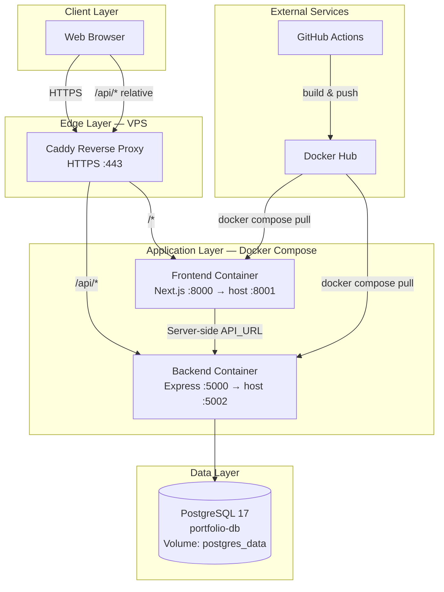

### 2.2 Layered Architecture

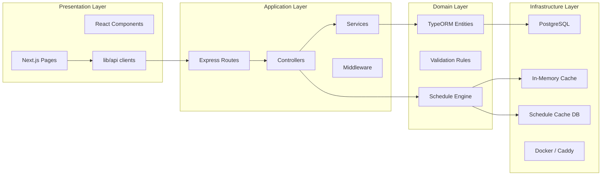

### 2.3 Network & Port Map (Production VPS)

| Service | Container | Internal Port | Host Port | Public Access |
|---------|-----------|---------------|-----------|---------------|
| Frontend | `portfolio-frontend` | 8000 | 8001 | `https://www.mahmoudhaisam.com` |
| Backend | `portfolio-backend` | 5000 | 5002 | `https://www.mahmoudhaisam.com/api/*` |
| Database | `portfolio-db` | 5432 | — (internal only) | Docker network only |

**Caddy routing** (`Caddyfile`):

```
mahmoudhaisam.com, www.mahmoudhaisam.com {
    reverse_proxy /api/* localhost:5002
    reverse_proxy localhost:8001
}
```

---

## 3. Database Design & ERD

### 3.1 Entity Relationship Diagram

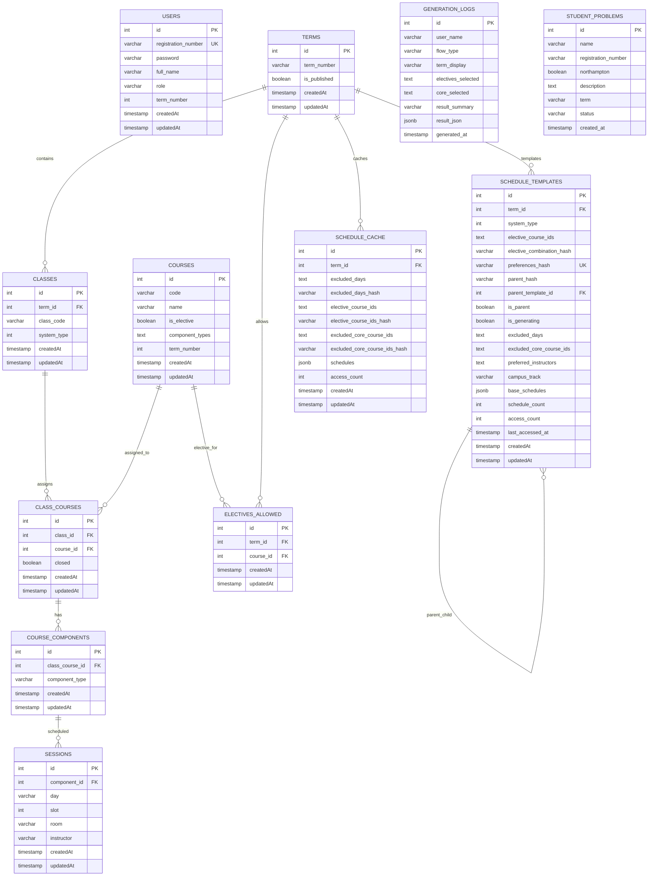

### 3.2 Data Hierarchy (Scheduling Core)

```
Term
 └── Class (system_type: 140 | 160 | 180)
      └── ClassCourse (closed: boolean)
           └── CourseComponent (L | S | LB)
                └── Session (day, slot, room, instructor)
      └── Course (via ClassCourse)
Term
 └── ElectivesAllowed → Course
```

### 3.3 Production Database Statistics (Live Snapshot)

| Table | Rows (approx.) |
|-------|----------------|
| terms | 9 |
| users | 2 |
| sessions | 587 |
| class_courses | 261 |
| course_components | 593 |
| courses | 70 |
| classes | 42 |
| schedule_templates | 36 |
| generation_logs | 752 |
| electives_allowed | 21 |

### 3.4 Published Terms (Live)

| term_number | system_types | Published |
|-------------|--------------|-----------|
| 3 | 140 | Yes |
| 4 | 140, 160 | Yes |
| 5 | 160 | Yes |
| 6 | 160, 180 | Yes |
| 7 | 160 | Yes |
| 8 | 160 | Yes |
| 9 | 180 | Yes |
| 10 | 180 | Yes |
| Other_Departments | — | Draft |

---

## 4. Database Connection

### 4.1 Production (VPS — Local Docker Postgres)

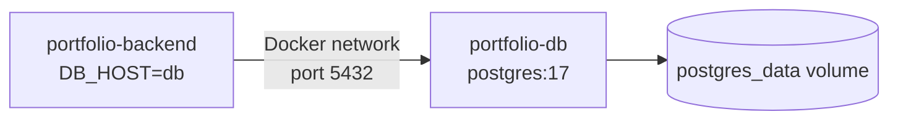

**Backend `.env` (VPS):**

```env
DB_HOST=db
DB_PORT=5432
DB_USERNAME=timetable_admin
DB_PASSWORD=***
DB_NAME=timetable_db
DB_SSL=false
```

**Root `.env` (Postgres container):**

```env
POSTGRES_USER=timetable_admin
POSTGRES_PASSWORD=***
POSTGRES_DB=timetable_db
```

**TypeORM config:** `backend/src/config/data-source.ts`

- `synchronize: false` in production (schema from SQL dump / migrations)
- Connection pool: max 20, min 2, idle timeout 10s
- SSL: disabled for local Docker; enabled for cloud (Neon)

### 4.2 Connection Pool Settings

| Setting | Value | Purpose |
|---------|-------|---------|
| `max` | 20 | Max concurrent connections |
| `min` | 2 | Minimum idle connections |
| `idleTimeoutMillis` | 10000 | Close idle connections quickly |
| `connectionTimeoutMillis` | 10000 | Fail fast on connect issues |
| `keepAlive` | true | Prevent cloud DB disconnects |
| `statement_timeout` | 10000 | Query timeout (ms) |

### 4.3 Database Restore (One-Time)

```bash
cd /root/portfolio
bash cicd/deployment/06-restore-database.sh
docker compose restart backend   # Clear in-memory cache
```

Source file: `terms.sql` (~132 MB pg_dump from PostgreSQL 17)

---

## 5. Sequence Diagrams

### 5.1 Admin Login Flow

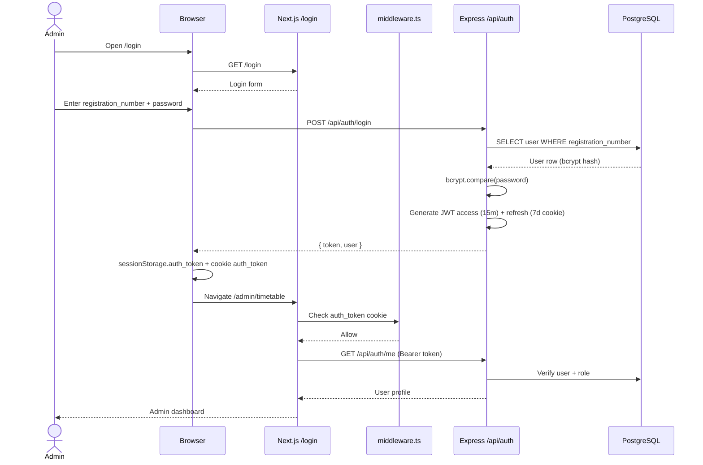


### 5.2 Student Schedule Generation Flow

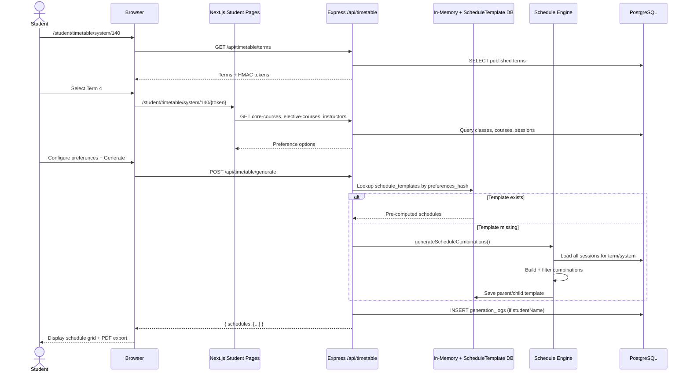

### 5.3 VPS Deployment Flow

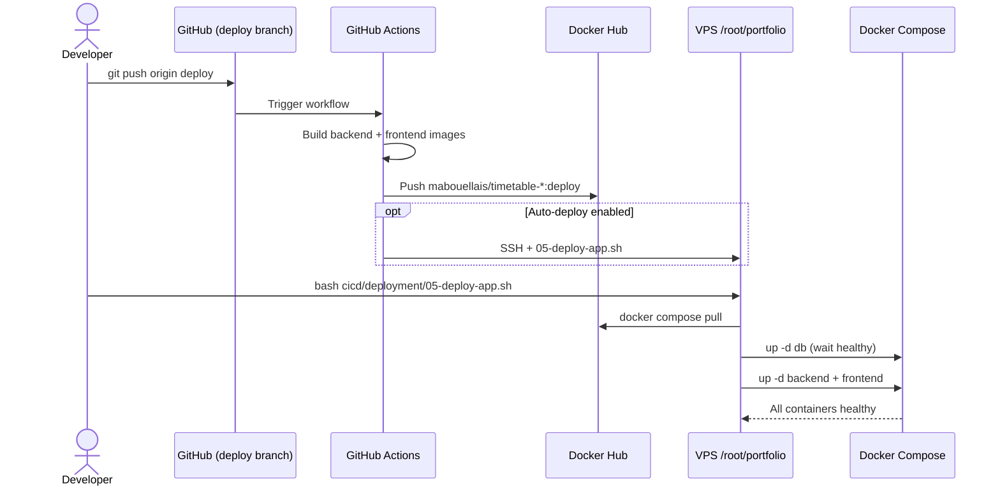

### 5.4 Database Import Flow (First Setup)

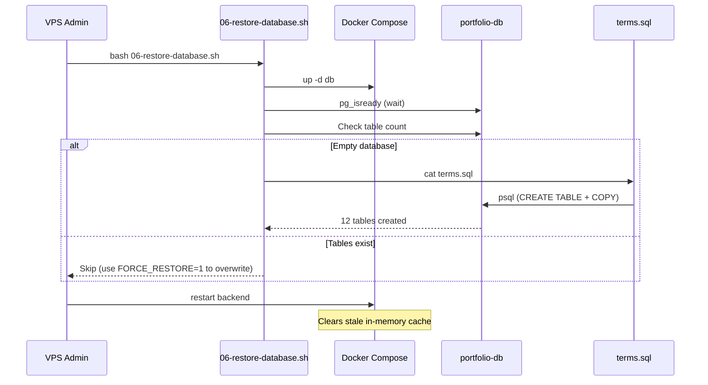

---

## 6. Backend Reference

### 6.1 Route Mounting (`backend/src/app.ts`)

| Mount Path | Router | Auth |
|------------|--------|------|
| `/api/auth` | authRoutes | Mixed |
| `/api/timetable` | timetableViewRoutes | Public + Admin |
| `/api/terms` | termRoutes | Admin + CSRF |
| `/api/courses` | courseRoutes | Admin + CSRF |
| `/api/classes` | classDirectRoutes | Admin + CSRF |
| `/api/classes/:classId/courses` | classCourseRoutes | Admin + CSRF |
| `/api/class-courses` | classCourseDirectRouter | Admin + CSRF |
| `/api/class-courses/:id/components` | componentRoutes | Admin + CSRF |
| `/api/components/:componentId/sessions` | sessionRoutes | Admin + CSRF |
| `/api/sessions` | sessionDirectRoutes | Admin + CSRF |
| `/api/terms/:termId/classes` | classRoutes | Admin + CSRF |
| `/api/terms/:termId/electives` | electiveRoutes | Admin + CSRF |
| `/api/other-dept` | otherDeptRoutes | Admin + CSRF |
| `/api/generation-logs` | generationLogRoutes | Admin + CSRF |
| `/api/problems` | studentProblemRoutes | Public POST / Admin GET |

### 6.2 Complete API Endpoint List

#### Auth — `/api/auth`

| Method | Endpoint | Auth | Description |
|--------|----------|------|-------------|
| POST | `/register` | Public | Register admin user |
| POST | `/login` | Public | Login → JWT + refresh cookie |
| POST | `/refresh` | Cookie | Refresh access token |
| POST | `/logout` | Bearer | Logout |
| GET | `/me` | Bearer | Current user profile |

#### Timetable (Public) — `/api/timetable`

| Method | Endpoint | Description |
|--------|----------|-------------|
| GET | `/terms` | Published terms with system types |
| GET | `/terms/:termId` | Full term timetable |
| GET | `/terms/:termId/core-courses` | Core courses for system |
| GET | `/terms/:termId/elective-courses` | Elective courses |
| GET | `/terms/:termId/instructors` | Instructors for term |
| GET | `/instructors/courses` | Instructor course mapping |
| GET | `/other/courses` | Other-section courses |
| GET | `/electives/slots` | Elective slot availability |
| POST | `/generate` | Generate student schedules |
| POST | `/other/generate` | Generate other-section schedules |
| GET | `/classes/:classId` | Single class timetable |

#### Timetable (Admin) — `/api/timetable/admin`

| Method | Endpoint | Description |
|--------|----------|-------------|
| GET | `/templates` | List schedule templates |
| GET | `/terms/:termId/courses` | All courses for term |
| POST | `/templates/generate/:termId` | Pre-generate templates |
| DELETE | `/templates/:termId/invalidate` | Invalidate term templates |
| DELETE | `/templates/:templateId` | Delete single template |
| POST | `/templates/cleanup` | Cleanup orphaned templates |

#### Terms (Admin) — `/api/terms`

| Method | Endpoint | Description |
|--------|----------|-------------|
| POST | `/` | Create term |
| GET | `/` | List all terms |
| GET | `/:id` | Get term by ID |
| PUT | `/:id` | Update term |
| DELETE | `/:id` | Delete term |
| POST | `/:id/publish` | Publish term |
| POST | `/:id/unpublish` | Unpublish term |
| POST | `/:id/validate` | Validate term data |

#### Sessions (Admin) — `/api/sessions`

| Method | Endpoint | Description |
|--------|----------|-------------|
| GET | `/instructors` | All instructor names |
| GET | `/instructors/schedule` | Instructor schedules |
| GET | `/instructors/with-sessions` | Optimized instructor data |
| GET | `/room-schedule` | Room occupancy data |
| GET | `/instructor/:instructorName` | Sessions by instructor |
| PUT | `/:id` | Update session |
| DELETE | `/:id` | Delete session |

#### Problems — `/api/problems`

| Method | Endpoint | Auth | Description |
|--------|----------|------|-------------|
| POST | `/` | Public | Submit problem report |
| GET | `/` | Admin | List all problems |
| PATCH | `/:id` | Admin | Update status |

### 6.3 Rate Limiting

| Limiter | Limit | Routes |
|---------|-------|--------|
| login | 10 / 15 min | `/api/auth/login` |
| general | 100 / min | Default |
| timetable | 300 / min | `/api/timetable/*` |
| scheduleGeneration | 1000 / min | Generate endpoints |
| refreshToken | 20 / min | `/api/auth/refresh` |

### 6.4 Controllers & Services

| File | Responsibility |
|------|----------------|
| `timetableViewController.ts` | Schedule generation engine (~4300 lines) |
| `scheduleTemplateController.ts` | Template admin operations |
| `termController.ts` | Term CRUD, publish, validate |
| `sessionController.ts` | Session CRUD |
| `authController.ts` | Authentication |
| `studentProblemController.ts` | Problem reports |
| `generationLogController.ts` | Generation audit |
| `validationService.ts` | Pre-publish validation |
| `scheduleTemplateService.ts` | Template lookup/save |

---

## 7. Frontend Reference — All Routes & Screenshots

> All screenshots captured live from **https://www.mahmoudhaisam.com** — August 2026.

### 7.1 Route Map (Complete — 28 Pages)

| # | Route | File | Auth | Screenshot |
|---|-------|------|------|------------|
| 1 | `/` | `app/page.tsx` | Public | ✅ |
| 2 | `/login` | `app/login/page.tsx` | Public | ✅ |
| 3 | `/problem` | `app/problem/page.tsx` | Public | ✅ |
| 4 | `/test-api` | `app/test-api/page.tsx` | Public | ✅ |
| 5 | `/timetable` | `app/timetable/page.tsx` | Public | ✅ |
| 6 | `/timetable/terms/[id]` | `app/timetable/terms/[id]/page.tsx` | Public | ✅ |
| 7 | `/student/timetable` | `app/student/timetable/page.tsx` | Public | ✅ |
| 8 | `/student/timetable/system/[systemType]` | `app/student/timetable/system/[systemType]/page.tsx` | Public | ✅ (140/160/180) |
| 9 | `/student/timetable/system/[systemType]/[termId]` | `.../[termId]/page.tsx` | Public | ✅ |
| 10 | `/student/timetable/system/[systemType]/[termId]/schedules` | `.../schedules/page.tsx` | Public | ✅ |
| 11 | `/student/timetable/other` | `app/student/timetable/other/page.tsx` | Public | ✅ |
| 12 | `/student/timetable/other/schedules` | `.../other/schedules/page.tsx` | Public | ✅ |
| 13 | `/student/timetable/electives` | `app/student/timetable/electives/page.tsx` | Public | ✅ |
| 14 | `/student/manual` | `app/student/manual/page.tsx` | Public | ✅ |
| 15 | `/student/timetable/[termId]` | `app/student/timetable/[termId]/page.tsx` | Public | Legacy |
| 16 | `/student/timetable/[termId]/schedules` | `.../[termId]/schedules/page.tsx` | Public | Legacy |
| 17 | `/student/timetable/[termId]/all-classes` | `.../all-classes/page.tsx` | Public | ✅ |
| 18 | `/admin/timetable` | `app/admin/timetable/page.tsx` | Admin | ✅ |
| 19 | `/admin/timetable/terms/[id]` | `app/admin/timetable/terms/[id]/page.tsx` | Admin | ✅ |
| 20 | `/admin/timetable/classes/[id]` | `app/admin/timetable/classes/[id]/page.tsx` | Admin | ✅ |
| 21 | `/admin/timetable/courses` | `app/admin/timetable/courses/page.tsx` | Admin | ✅ |
| 22 | `/admin/timetable/instructors` | `app/admin/timetable/instructors/page.tsx` | Admin | ✅ |
| 23 | `/admin/timetable/templates` | `app/admin/timetable/templates/page.tsx` | Admin | ✅ |
| 24 | `/admin/timetable/coursesForOtherDept` | `app/admin/timetable/coursesForOtherDept/page.tsx` | Admin | ✅ |
| 25 | `/admin/timetable/generation-logs` | `app/admin/timetable/generation-logs/page.tsx` | Admin | ✅ |
| 26 | `/admin/room-schedule` | `app/admin/room-schedule/page.tsx` | Admin | ✅ |
| 27 | `/admin/problems` | `app/admin/problems/page.tsx` | Admin | ✅ |
| 28 | `/admin/all_instructors` | `app/admin/all_instructors/page.tsx` | Admin | ✅ |

---

### 7.2 Public & Portfolio Screens

#### 7.2.1 Portfolio Home — `/`

**URL:** https://www.mahmoudhaisam.com/


---

#### 7.2.2 Login — `/login`

**URL:** https://www.mahmoudhaisam.com/login

Admin authentication using **registration number** + **password**. Redirects to `/admin/timetable` on success.


---

#### 7.2.3 Problem Report — `/problem`

**URL:** https://www.mahmoudhaisam.com/problem

Public form for students to report timetable issues.


---

#### 7.2.4 Legacy Timetable — `/timetable`

**URL:** https://www.mahmoudhaisam.com/timetable


---

#### 7.2.5 Legacy Term View — `/timetable/terms/4`

**URL:** https://www.mahmoudhaisam.com/timetable/terms/4

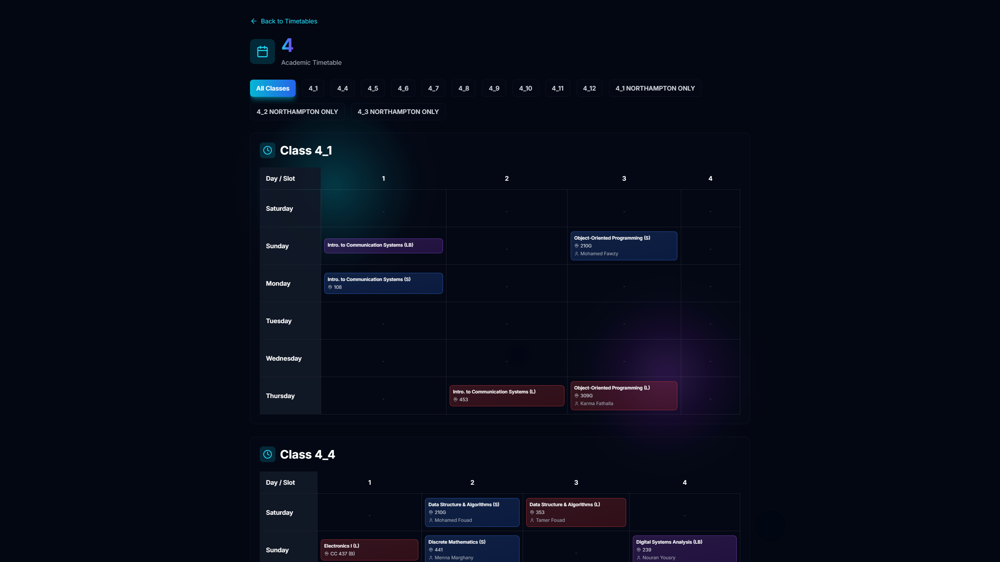

---

#### 7.2.6 API Test Page — `/test-api`

**URL:** https://www.mahmoudhaisam.com/test-api

Development/diagnostic page for backend connectivity.

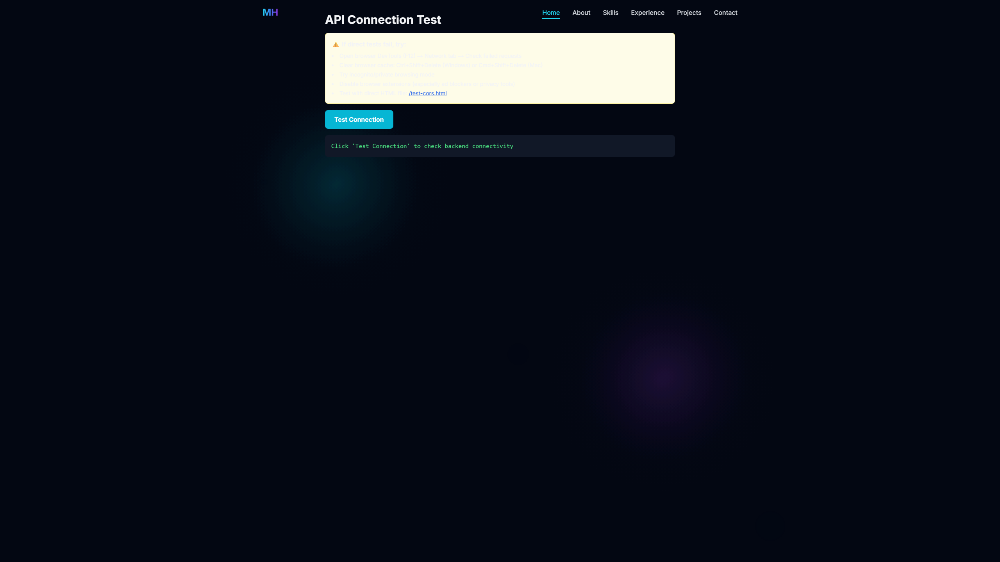

---

### 7.3 Student Timetable Generator Screens

#### 7.3.1 System Picker — `/student/timetable`

**URL:** https://www.mahmoudhaisam.com/student/timetable

Entry point — choose credit system (140 / 160 / 180) or Other section.


---

#### 7.3.2 System 140 Terms — `/student/timetable/system/140`


---

#### 7.3.3 System 160 Terms — `/student/timetable/system/160`


---

#### 7.3.4 System 180 Terms — `/student/timetable/system/180`


---

#### 7.3.5 Term 4 Preferences (System 140) — `/student/timetable/system/140/{token}`

**URL example:** `.../system/140/NDplY2ZkMmZjY2M3YzBhYTg1NDEwYjMxOGMxN2E3ODgzNTI5OGU1MWUzYTExYjRlMjNmOGEzM2ZkYWUyZDdlNDc0`

Course selection, excluded days, electives, instructors, campus track (Term 4).


---

#### 7.3.6 Generated Schedules — `/student/timetable/system/140/{token}/schedules`

Schedule results grid with PDF export. Term 4 requires campus track selection.


---

#### 7.3.7 Other Section — `/student/timetable/other`


---

#### 7.3.8 Other Section Schedules — `/student/timetable/other/schedules`


---

#### 7.3.9 Electives View — `/student/timetable/electives`


---

#### 7.3.10 Student Manual — `/student/manual`


---

#### 7.3.11 All Classes Timetable — `/student/timetable/4/all-classes`

View all class timetables for a term (including Northampton-only classes).


---

### 7.4 Admin Portal Screens

> Requires admin login at `/login`.

#### 7.4.1 Dashboard — `/admin/timetable`

**URL:** https://www.mahmoudhaisam.com/admin/timetable

Main hub — term list, navigation to all admin modules, Create Term, Logout.


---

#### 7.4.2 Courses — `/admin/timetable/courses`

Course catalog management (create, edit, delete, component types).


---

#### 7.4.3 Instructors — `/admin/timetable/instructors`

Instructor schedule grid per term.


---

#### 7.4.4 Templates — `/admin/timetable/templates`

Pre-generate and manage hierarchical schedule templates.


---

#### 7.4.5 Other Departments — `/admin/timetable/coursesForOtherDept`

Manage courses for non-standard departments.


---

#### 7.4.6 Room Schedule — `/admin/room-schedule`

Room occupancy grid across all sessions.


---

#### 7.4.7 Generation Logs — `/admin/timetable/generation-logs`

Audit log of all student schedule generations.


---

#### 7.4.8 Student Problems — `/admin/problems`

Triage student-reported problems (pending → solved/not_solved).


---

#### 7.4.9 All Instructors — `/admin/all_instructors`

Overview of all instructors across terms.


---

#### 7.4.10 Term Detail — `/admin/timetable/terms/4`

Term 4 management — classes, publish status, validation.


---

#### 7.4.11 Other Departments Term — `/admin/timetable/terms/12`


---

#### 7.4.12 Class Detail — `/admin/timetable/classes/1`

Class editor — assigned courses, components (L/S/LB), sessions.


---

## 8. Authentication & Security

### 8.1 Token Architecture

| Token | Storage | Lifetime | Purpose |
|-------|---------|----------|---------|
| Access JWT | `sessionStorage` + cookie | 15 minutes | API authorization |
| Refresh JWT | httpOnly cookie | 7 days | Token renewal |
| CSRF token | `sessionStorage` | Per session | Admin mutations |
| Term token | URL parameter | Stateless HMAC | Obfuscate term IDs |

### 8.2 Middleware Chain (Admin Routes)

```
Request → requireAuth (JWT verify) → validateCSRFToken → requireAdmin (DB role check) → Controller
```

### 8.3 Security Headers

**Caddy / Next.js middleware:**
- Content-Security-Policy
- Strict-Transport-Security (HSTS, 6 months)
- X-Frame-Options: DENY
- X-Content-Type-Options: nosniff
- Referrer-Policy: strict-origin-when-cross-origin

### 8.4 Term ID Obfuscation

Raw term IDs are never exposed to students. HMAC-SHA256 tokens (`backend/src/utils/termToken.ts`):

```
encodeTermId(4) → "NDplY2ZkMmZjY2M3YzBhYTg1NDEwYjMxOGMxN2E3ODgzNTI5OGU1MWUzYTExYjRlMjNmOGEzM2ZkYWUyZDdlNDc0"
```

Requires `TERM_TOKEN_SECRET` (≥32 characters).

---

## 9. Core Features & Algorithms

### 9.1 Hierarchical Schedule Templates

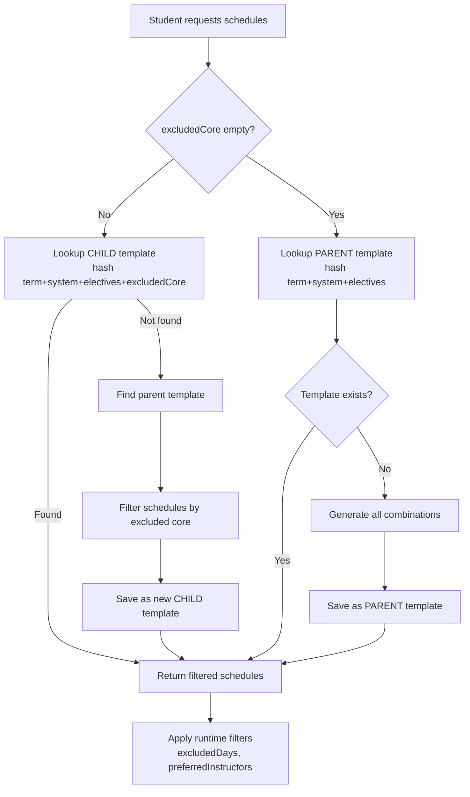

### 9.2 Caching Strategy

| Layer | Storage | TTL | Keys |
|-------|---------|-----|------|
| In-memory | Node.js Map | 5 min | Published terms, timetables, electives |
| PostgreSQL | `schedule_cache` | Persistent | Preference hash combinations |
| PostgreSQL | `schedule_templates` | Persistent | Pre-computed schedule combinations |

**Cache invalidation triggers:** term publish/unpublish, course closure, template invalidation, DB restore (restart backend).

### 9.3 Schedule Generation Engine

Located in `backend/src/controllers/timetableViewController.ts`:

1. Load all classes for term + system type
2. Load courses (core + selected electives)
3. Load all sessions for course components
4. Build schedule combinations (conflict detection: same day/slot)
5. Apply filters: excluded days, excluded core, preferred instructors, campus track
6. Score and rank schedules
7. Return top combinations + log to `generation_logs`

### 9.4 Term Validation Before Publish

`validationService.ts` checks:
- All classes have courses assigned
- All courses have required components (L, S, LB)
- All components have sessions scheduled
- No scheduling conflicts within classes
- Electives configured if needed

### 9.5 Class Course Closure

Admin can mark `class_courses.closed = true` to exclude a course from generation without deleting data. Invalidates related caches and template hashes.

---

## 10. Deployment & CI/CD

### 10.1 Deployment Architecture

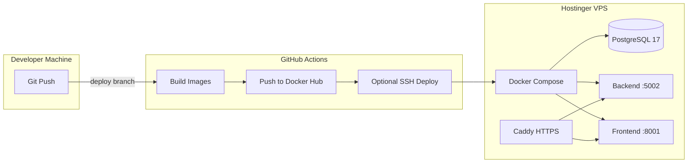

### 10.2 VPS File Layout

```
/root/portfolio/
├── .env                         # Postgres credentials
├── docker-compose.yml           # db + backend + frontend
├── terms.sql                    # Database dump (manual)
├── backend/.env                 # App config (DB_HOST=db)
└── cicd/deployment/
    ├── 05-deploy-app.sh         # Every deploy
    ├── 06-restore-database.sh   # One-time DB import
    └── check-status.sh          # Health check
```

### 10.3 CI/CD Pipeline

**File:** `.github/workflows/docker-build-push.yml`

| Trigger | Action |
|---------|--------|
| Push to `deploy` branch | Build + push Docker images |
| `VPS_DEPLOY_ENABLED=true` | SSH deploy via `05-deploy-app.sh` |

**Docker Hub images:**
- `mabouellais/timetable-backend:deploy`
- `mabouellais/timetable-frontend:deploy`

### 10.4 Deploy Commands

```bash
# Every code update
cd /root/portfolio
bash cicd/deployment/05-deploy-app.sh

# First-time DB import
bash cicd/deployment/06-restore-database.sh
docker compose restart backend

# Health check
bash cicd/deployment/check-status.sh
```

Full guide: `deploy/vps/SERVER_SETUP.md`

---

## 11. Environment Variables

### 11.1 Backend (`backend/.env`)

| Variable | Production Value | Description |
|----------|------------------|-------------|
| `DB_HOST` | `db` | Docker service name |
| `DB_PORT` | `5432` | PostgreSQL port |
| `DB_USERNAME` | `timetable_admin` | DB user |
| `DB_PASSWORD` | *(secret)* | DB password |
| `DB_NAME` | `timetable_db` | Database name |
| `DB_SSL` | `false` | SSL (false for local Docker) |
| `NODE_ENV` | `production` | Environment |
| `PORT` | `5000` | Server port |
| `HOST` | `0.0.0.0` | Bind address |
| `JWT_SECRET` | *(≥32 chars)* | JWT signing |
| `TERM_TOKEN_SECRET` | *(≥32 chars)* | Term HMAC |
| `CORS_ORIGIN` | `https://www.mahmoudhaisam.com,...` | Allowed origins |

### 11.2 Frontend (Docker)

| Variable | Production Value |
|----------|------------------|
| `NEXT_PUBLIC_API_URL` | `/api` |
| `API_URL` | `http://backend:5000` |
| `NODE_ENV` | `production` |

### 11.3 Postgres Container (root `.env`)

| Variable | Value |
|----------|-------|
| `POSTGRES_USER` | `timetable_admin` |
| `POSTGRES_PASSWORD` | *(must match DB_PASSWORD)* |
| `POSTGRES_DB` | `timetable_db` |

---

## 12. Operations & Troubleshooting

### 12.1 Health Checks

```bash
curl -s https://www.mahmoudhaisam.com/api/health
curl -s https://www.mahmoudhaisam.com/api/timetable/terms
docker compose ps
bash cicd/deployment/check-status.sh
```

### 12.2 Common Issues

| Issue | Cause | Fix |
|-------|-------|-----|
| Site shows no data after DB restore | Stale in-memory cache | `docker compose restart backend` |
| Backend can't connect to DB | Wrong `DB_HOST` | Set `DB_HOST=db` in `backend/.env` |
| `POSTGRES_PASSWORD` error | Missing root `.env` | Create `/root/portfolio/.env` |
| Admin redirect loop | Expired token | Clear cookies, re-login |
| 0 schedules for Term 4 | Missing campus track | Select northampton/normal on preferences page |

### 12.3 Database Access

```bash
docker compose exec db psql -U timetable_admin -d timetable_db
```

```sql
-- Useful queries
SELECT id, term_number, is_published FROM terms ORDER BY id;
SELECT count(*) FROM sessions;
SELECT registration_number, role, full_name FROM users;
SELECT status, count(*) FROM student_problems GROUP BY status;
```

### 12.4 Logs

```bash
docker compose logs -f backend
docker compose logs -f frontend
docker compose logs -f db
```

---

## 13. Appendix — File Index

### 13.1 Documentation Files (Kept)

| File | Purpose |
|------|---------|
| `docs/SYSTEM_DOCUMENTATION.md` | **This file** — complete system docs |
| `README.md` | Project overview + quick start |
| `deploy/vps/SERVER_SETUP.md` | VPS setup guide |
| `backend/README.md` | Backend API reference |
| `backend/docs/SCHEDULE_TEMPLATES_QUERY_SOURCE.md` | Template query logic |
| `backend/SCHEDULE_CACHING.md` | Cache architecture |
| `backend/REDIS_RATE_LIMITER.md` | Rate limiter notes |
| `tests/README.md` | Test suite guide |

### 13.2 Screenshots Index

All screenshots use a **uniform 2560×1440 viewport** (no per-page CSS zoom) so text and UI scale match across every route. Long pages are split into numbered sections (`-1`, `-2`, …) plus a stitched `-full` reference.

| Folder | Primary routes | Notes |
|--------|----------------|-------|
| `docs/screenshots/public/` | 7 routes | Portfolio split into 6 vertical sections |
| `docs/screenshots/student/` | 11 routes | Manual and all-classes split into multiple sections |
| `docs/screenshots/admin/` | 12 routes | Courses, room schedule, generation logs, all instructors use multi-section capture |

### 13.3 Key Source Files

| File | Lines | Purpose |
|------|-------|---------|
| `backend/src/controllers/timetableViewController.ts` | ~4300 | Schedule generation engine |
| `backend/src/app.ts` | ~250 | Express app + routes |
| `backend/src/config/data-source.ts` | ~80 | TypeORM config |
| `lib/api/timetable.ts` | ~350 | Frontend API client |
| `middleware.ts` | ~90 | Admin route protection |
| `Caddyfile` | ~55 | Production reverse proxy |
| `deploy/vps/docker-compose.yml` | ~68 | Production compose |

### 13.4 Admin Accounts (Database)

| Registration # | Name | Role |
|----------------|------|------|
| `00000` | Mahmoud Haisam | admin |
| `testadmin001` | Test Admin User | admin |

Login: https://www.mahmoudhaisam.com/login

---

*End of System Documentation — Generated from live production system at https://www.mahmoudhaisam.com*
